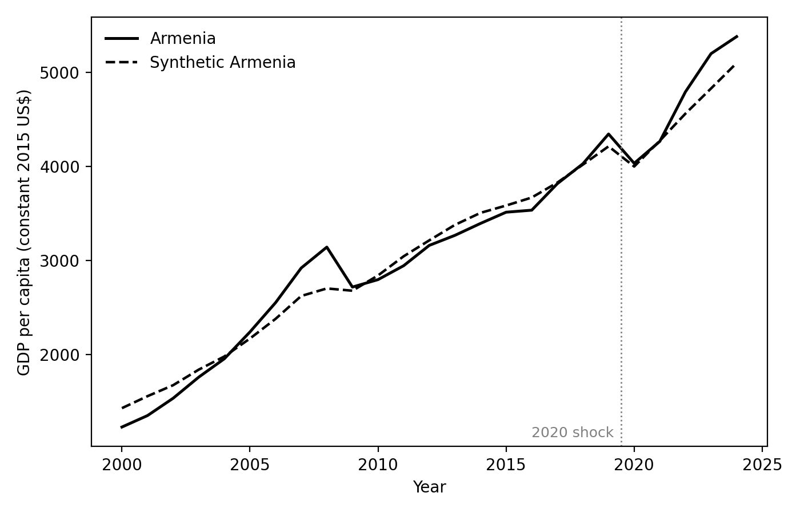
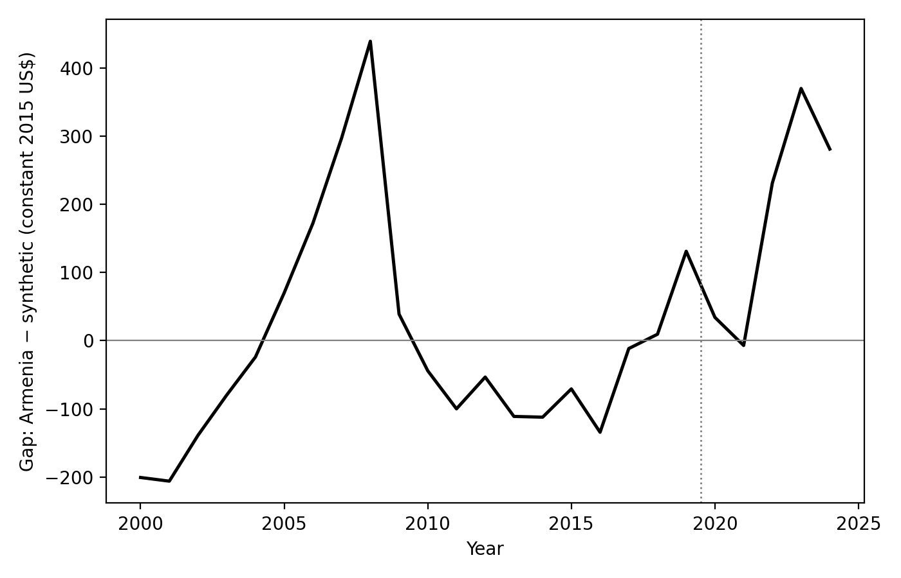
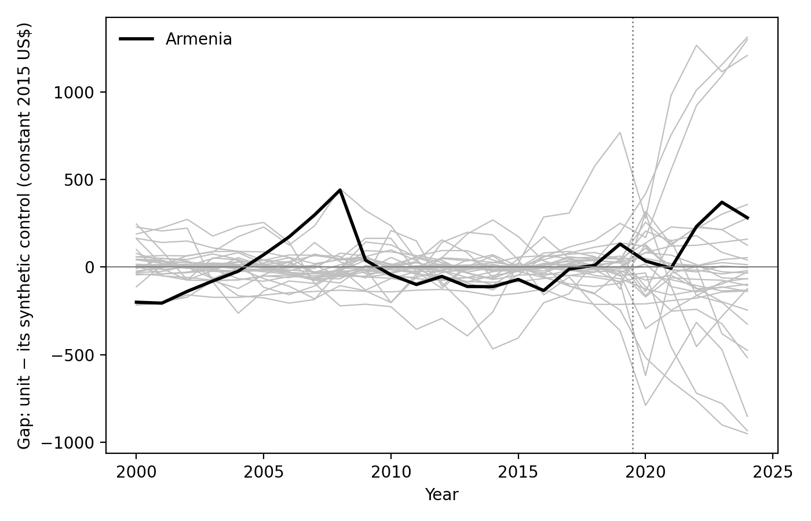
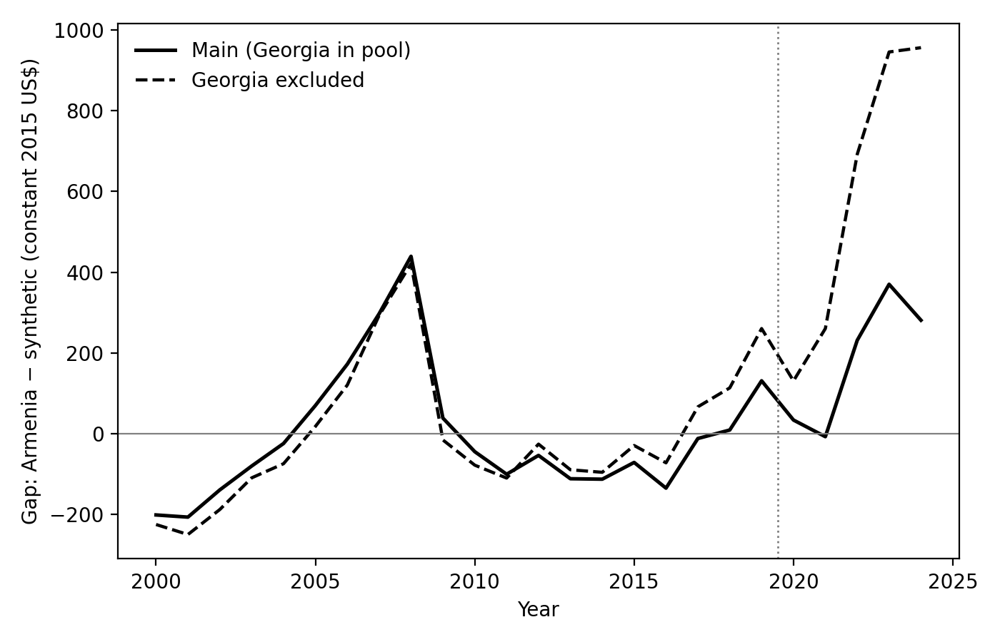
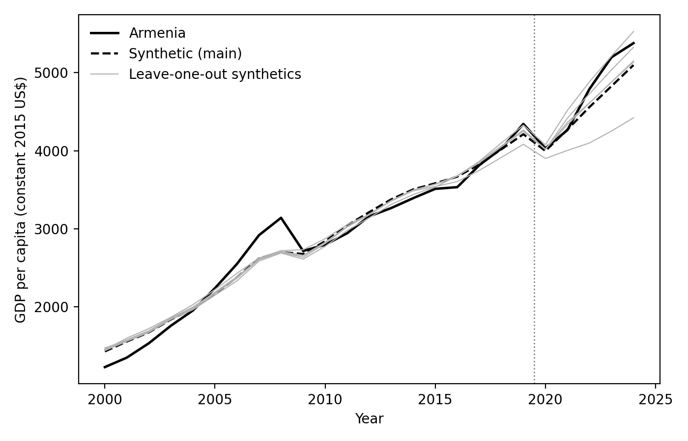
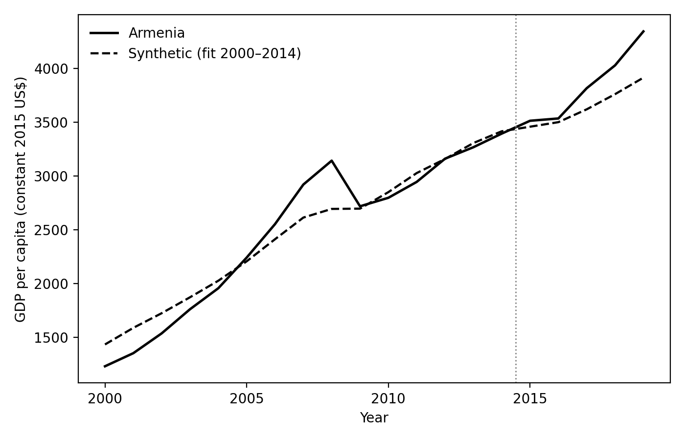

<!-- AUTHOR LINE PROVISIONAL: independent project (EconArmeniaSyntheticProject)
     that builds on and references the 2021 DataPoint Armenia exploration.
     Byline = Gary V. + three student contributors, credited by
     FIRST NAME ONLY by choice (this repo is public; each may add a last
     initial themselves if they wish -- do NOT expand to full names without
     their consent). Per-student contributions confirmed once their work lands.
     The original 2021 team (Nanneh C., Ruben D., and Gary V.) is credited as prior
     work in the footnote and the Appendix, not on the byline; they agreed to
     this framing. AI-assistance disclosure is in the footnote. -->

**Keywords:** synthetic control; Armenia; Nagorno-Karabakh war; COVID-19; comparative case studies.

**JEL codes:** C21; D74; O47.

# Introduction

On September 27, 2020, war broke out between Armenia and Azerbaijan over Nagorno-Karabakh and continued for 44 days, ending in a ceasefire on November 10 and a territorial settlement widely experienced in Armenia as a national catastrophe. The war arrived in the middle of a pandemic year in which Armenia's real GDP per capita fell 7.2 percent. Separating what the war cost from what COVID-19 was already costing is the natural first question of Armenian economic history of this period --- and it is a question with an awkward econometric structure, because every plausible comparison country was also treated by the pandemic.

This paper estimates the effect of Armenia's 2020 compound shock --- war and pandemic jointly --- on real GDP per capita using the synthetic control method of Abadie and Gardeazabal [1] and Abadie, Diamond, and Hainmueller [2, 3]. The method constructs a counterfactual Armenia as a convex combination of donor economies chosen to reproduce Armenia's pre-2020 growth path and economic structure; the post-2020 gap between Armenia and this synthetic counterpart is the estimated treatment effect. Because the donors lived through the pandemic too, the design differences out the common pandemic experience, and the estimand is best read as the *differential* effect of Armenia's 2020 --- the war, plus any deviation of Armenia's pandemic severity from the donors' --- rather than the effect of the war alone. We state this compound-treatment framing at the outset because the results make no sense without it.

Three findings emerge. First, in the war years themselves there is nothing to see: Armenia's 2020--21 path is statistically indistinguishable from its synthetic control, and by the standard placebo metric Armenia deviates *less* over that window than any of the 30 donors. Second, from 2022 onward Armenia sits persistently above its counterfactual --- by 5 to 8 percent in the main specification --- an excess that coincides with the relocation of roughly 2,600 companies and more than 100,000 individuals from Russia after February 2022 [5], and that therefore should not be attributed to the 2020 treatment. Third, the estimates are fragile in instructive ways: the sign of the 2021 gap flips under leave-one-out donor deletions, the 2022--24 gap triples without Georgia, and an in-time placebo shows that five-year counterfactual extrapolations from these data drift by roughly ten percent. We report the fragility as a result in its own right, not as a footnote.

The contribution is accordingly modest and mostly cautionary. For Armenia, the point estimates of the differential 2020--21 loss sit within one percent of zero, with a detection floor of several percent set by the era's placebo divergences --- which is emphatically not the claim that the war was costless, only that annual national accounts, benchmarked against economies undergoing their own COVID collapses, cannot detect an Armenia-specific increment. For practice, the exercise illustrates a general limit of comparative case studies of 2020-vintage events: when the "control" units are all treated by a concurrent global shock of heterogeneous severity, the synthetic control gap conflates the event of interest with the donors' shock draw, and placebo inference loses its meaning as a benchmark of normal variation.

# Data and Methodology

**Data.** All series come from the World Bank's World Development Indicators (WDI), retrieved July 3, 2026 [7]. The outcome is GDP per capita in constant 2015 US dollars (`NY.GDP.PCAP.KD`), observed 1994--2024; the estimation window is 2000--2024, with 2000--2019 as the pre-treatment period and 2020 as the first treated year. Predictors are the 2000--2019 means of gross capital formation and trade (each in percent of GDP), CPI inflation (annual percent), population growth (annual percent), and industry value added (percent of GDP), together with the lagged outcome in 2000, 2005, 2010, 2015, and 2019. One vintage quirk required a documented adjustment: the current WDI release reports Armenia's industry share only from 2012, so industry enters as its 2012--2019 mean for *all* units, keeping the predictor window consistent across treated and donor economies.

**Donor pool.** The candidate pool is 32 developing and transition economies spanning the post-Soviet space, the Balkans, MENA, South and Southeast Asia, Latin America, and Sub-Saharan Africa. It was assembled to exclude, at the design stage, candidate economies with large idiosyncratic shocks of their own during or shortly before the 2020--24 post-period: Azerbaijan (party to the same war), Lebanon (2019--20 financial collapse), Sri Lanka (2022 default), Belarus (2020 political crisis), Ukraine and Russia (2022 war), Myanmar (2021 coup), and Turkey (its 2018--23 currency crisis). A completeness screen then dropped Jordan (investment and trade series end in 2007) and Uzbekistan (CPI series begins in 2011), leaving 30 donors. Georgia stays in the main pool --- it is Armenia's closest structural comparator --- but because it received the same 2022 Russian relocation inflow as Armenia, we treat its inclusion as a first-order robustness question rather than a settled choice.

**Estimator.** Donor weights solve the standard nested optimization of Abadie, Diamond, and Hainmueller [2]: weights are non-negative and sum to one, and the predictor-importance matrix is chosen so that the weighted donors reproduce Armenia's pre-treatment outcome path as closely as possible. Estimates are computed with the `pysyncon` package (v1.5.2) in Python; for each fit we run a small grid of optimizer settings (Nelder--Mead and BFGS, from equal and regression-based starting weights) and keep the solution with the lowest pre-treatment root mean squared prediction error (RMSPE), computed over each fit's pre-treatment window (2000--2019 for the main specification).^[The grid guards against the sensitivity of synthetic control weights to optimizer initialization; the selected setting is reported in the replication output.]

**Inference.** We use in-space placebos [2, 3]: each donor is treated as if it, too, had been shocked in 2020, and its synthetic control is fitted with the same specification. Ranking Armenia's ratio of post- to pre-treatment RMSPE within the distribution of all 31 such ratios yields a permutation p-value --- the probability of a divergence as unusual as Armenia's if the "treatment" were assigned at random. We compute the ratio both over the full post period (2020--24) and over the war window (2020--21) alone. Under the compound-treatment framing, this inference answers a narrower question than usual: not "did anything happen to Armenia in 2020?" (something happened everywhere) but "did Armenia diverge from its own counterfactual by more than pandemic-era economies typically diverged from theirs?"

# Results

**Fit.** The synthetic Armenia combines Georgia (weight 0.41), Cambodia (0.28), Kazakhstan (0.13), Tajikistan (0.10), and Rwanda (0.08), with a negligible residual weight (0.002) on Moldova. Table 1 shows the predictor balance and Figure 1 the paths. Pre-treatment fit is adequate rather than excellent: the pre-2020 RMSPE is \$159, or 5.7 percent of Armenia's pre-period mean GDP per capita. The misses are not random. Armenia's construction-boom peak of 2006--08 rises up to 16 percent above the synthetic --- no convex combination of donors reproduces a boom that extreme --- while the fit over the final pre-treatment decade, 2009--2019, stays within about 4 percent throughout; the 2019 residual is $+3.1$ percent, a number that matters below. Since the counterfactual's credibility rests most heavily on the years closest to treatment, we regard the fit as usable, and let the placebo inference, which normalizes by pre-treatment fit, discipline the rest.

Table: Predictor balance. Predictors are 2000--2019 means unless noted; industry share is the 2012--2019 mean (see text). Donor mean is the unweighted average over the 30-country pool.

|                                     | Armenia | Synthetic | Donor mean |
|:------------------------------------|--------:|----------:|-----------:|
| Investment / GDP (%)                |    28.7 |      26.2 |       24.7 |
| Trade / GDP (%)                     |    72.9 |      93.3 |       78.6 |
| CPI inflation (%)                   |     3.5 |       5.8 |        6.4 |
| Population growth (%)               |    -0.3 |       0.7 |        1.2 |
| Industry / GDP (%), 2012--19        |    25.8 |      25.7 |       27.2 |
| GDP p.c. 2000 (2015 US\$)           |   1,229 |     1,431 |      2,118 |
| GDP p.c. 2005                       |   2,240 |     2,171 |      2,538 |
| GDP p.c. 2010                       |   2,796 |     2,841 |      3,071 |
| GDP p.c. 2015                       |   3,512 |     3,584 |      3,585 |
| GDP p.c. 2019                       |   4,343 |     4,213 |      4,045 |

{width=70%}

**The war years: no detectable differential loss.** In 2020 Armenia's GDP per capita fell 7.2 percent; its synthetic control fell 5.1 percent, almost exactly the donor-pool average --- the counterfactual embeds a typical pandemic year for this class of economies, with Georgia (down 6.4 percent) and Cambodia (down 5.0 percent) carrying most of the weight. The level gap nonetheless lands at only $+\$34$ ($+0.9$ percent, Figure 2), because Armenia entered 2020 sitting 3.1 percent above its counterfactual --- the residue of a late-2010s acceleration the donors do not fully reproduce. In 2021 the gap is $-\$7$ ($-0.2$ percent). Read in growth rates, then, Armenia's pandemic-and-war year was about two points worse than its synthetic; read in levels --- the estimand the method actually defends --- a year that also brought roughly 90,000 displaced persons into the country [6] left Armenia within one percent of its counterfactual. Neither reading clears the placebo bar that follows.

{width=70%}

The placebo distribution makes the null precise (Figure 3). Over the full post period, Armenia's post/pre RMSPE ratio of 1.46 ranks 25th of 31 units, a permutation p-value of 0.81; over the 2020--21 window alone Armenia ranks 31st of 31 --- every single donor, fitted with the identical specification, diverged from its synthetic control by more (relative to pre-treatment fit) than Armenia did. This is the compound-treatment problem in one number: 2020 moved every economy off its pre-pandemic trajectory, so the placebo distribution measures pandemic-era turbulence, not sampling noise, and within that turbulence Armenia's realized path is about as unremarkable as it is possible to be.

{width=70%}

**From 2022: a boom the treatment cannot claim.** From 2022 the gap turns positive and stays there: $+5.1$ percent (2022), $+7.7$ percent (2023), $+5.5$ percent (2024). The timing lines up not with the 2020 shock but with the arrival, from March 2022, of about 2,600 relocated companies, 6,000 individual entrepreneurs, and 113,000 non-resident individuals --- overwhelmingly from Russia --- documented by the IMF, alongside real GDP growth of 12.6 percent in 2022 [5]. We therefore read the 2022--24 gap as the fingerprint of a distinct, positive shock, not a delayed recovery effect of the treatment under study; the arc of the estimates --- flat through the war, above the counterfactual after the relocation wave --- is a narrative about two different events, and only the first is ours to evaluate.

Table: Annual gaps, Armenia minus synthetic, in constant 2015 US\$ and in percent of the synthetic value; main specification and with Georgia excluded from the donor pool.

| Year | Gap, main (US\$) | Gap, main (%) | Gap, no Georgia (US\$) | Gap, no Georgia (%) |
|:-----|----------------:|--------------:|----------------------:|--------------------:|
| 2020 |             +34 |          +0.9 |                   +131 |                +3.4 |
| 2021 |              -7 |          -0.2 |                   +260 |                +6.5 |
| 2022 |            +231 |          +5.1 |                   +692 |               +16.9 |
| 2023 |            +370 |          +7.7 |                   +945 |               +22.2 |
| 2024 |            +281 |          +5.5 |                   +956 |               +21.6 |

**Robustness: Georgia, one donor at a time, and time itself.** Excluding Georgia reweights the synthetic toward Cambodia (0.71) and Kazakhstan (0.21) with a similar overall pre-treatment fit (RMSPE \$169) --- but the fit deteriorates exactly where it matters most: the 2019 residual doubles to $+6.4$ percent, so Armenia now enters the treatment window well above its counterfactual. The consequences are visible in Table 2 and Figure 4. The 2020--21 gaps turn positive (+3.4 and +6.5 percent), but much of that is the entering residual carried forward rather than fresh post-treatment divergence --- the 2020 gap is in fact *smaller* than the 2019 residual. The 2022--24 gaps roughly triple, to +17 to +22 percent, for a transparent reason: Georgia is the one heavily weighted donor that shares Armenia's relocation boom, so removing it removes the boom from the counterfactual and the shared component reappears in the gap. Each specification is contaminated in its own way --- with Georgia, the counterfactual absorbs part of a 2022--24 shock it should not contain; without Georgia, the pre-treatment anchor weakens. Neither detects a differential loss in the war years, and the width of the 2022--24 range --- 5 to 22 percent --- is the honest measure of how much these estimates ride on a single donor.

{width=70%}

Leave-one-out deletions of each donor with weight of at least 0.01 (Figure 5) tell the same story donor by donor: the 2021 gap ranges from $-\$252$ (dropping Kazakhstan) to $+\$260$ (dropping Georgia) --- it changes sign under single-donor perturbations, which is what "indistinguishable from zero" looks like in this design. Finally, an in-time placebo assigns a fake treatment in 2015 and fits only on 2000--2014. The resulting synthetic tracks Armenia through 2016 and then falls progressively behind: by 2019 Armenia stands 11 percent above it (Figure 6) --- Armenia's late-decade growth acceleration outruns what the donors would have predicted. The direct lesson is about extrapolation reliability: on these data, five-year-out counterfactual projections can drift by roughly ten percent absent any treatment, a scale bar that should be held up against every post-2020 gap in this paper. It also cuts in a specific direction: if Armenia carried genuine untreated momentum into 2020 that the synthetic understates, the true counterfactual lies above the estimated one, and our 2020--21 null would understate a real loss --- while part of the 2022--24 excess would be momentum rather than relocation.

{width=70%}

{width=70%}

We had planned international tourist arrivals as a secondary outcome --- tourism is a channel through which both war and pandemic should bite --- but the WDI arrivals series for Armenia currently ends in 2020, leaving a single post-treatment year, and we judged a one-year post-period unable to support credible inference. We note the gap and leave the channel to future data.

# Discussion

The natural headline --- "the war had no detectable effect on GDP per capita" --- would be a misreading, and most of what this study contributes is the discipline to say precisely what the estimates do and do not license.

**What the null is.** Relative to a counterfactual built from economies that took their own 2020 pandemic shocks, Armenia's 2020--21 GDP per capita shows no additional, Armenia-specific shortfall: the gaps are under one percent while placebo divergences of several percent were the era's norm. Given the war's human toll --- thousands of deaths, some 90,000 displaced into Armenia [6] --- and its fourth-quarter timing, a near-zero differential in *annual, national* GDP per capita is informative mainly about the resolution of the instrument: a six-week war fought outside Armenia's own production centers, in a year already dominated by a global contraction, does not move the annual aggregate beyond the pandemic-era noise floor.

**What the null is not.** It is not an estimate of the war's cost against a peacetime baseline; no such baseline exists in the donor pool by construction, and the donors-absorb-COVID assumption is doing irreducible work. Nor is the assumption innocuous, because pandemic severity was wildly heterogeneous across donors: 2020 per-capita outcomes in the pool run from $+2.1$ percent (Tajikistan) to $-13.8$ percent (Bolivia). The main synthetic's 2020 fall of 5.1 percent happens to sit at the pool average, but nothing in the pre-2020 fitting criterion pins down which pandemic Armenia "would have had": a counterfactual weighted toward the pool's mild end would have reported a war loss of several percent, and one weighted toward the Latin American collapses a similarly sized gain. That sensitivity is not a flaw we failed to fix --- the leave-one-out and Georgia exercises are there to display it --- but it means the point estimates carry uncertainty far beyond what any single placebo p-value expresses.

**The identification problem is general.** Synthetic control earns its credibility from untreated donors and long, quiet post-treatment windows [4]. Events of 2020 vintage offer neither: every donor is treated by the pandemic with unknown intensity, and Armenia's own post-period is contaminated after only two years by a second, positive shock --- the 2022 relocation inflow --- that also treats the most natural donor. The permutation p-values we report (0.81 full-post; 1.00 for 2020--21) are honest numbers, but what they quantify is Armenia's ordinariness within a treated distribution, not evidence against a war effect of conventional size. Researchers applying comparative case-study methods to COVID-era interventions face this structure generically; our results are a worked example of how little the annual-frequency version of the method can separate.

**What would do better.** Quarterly national accounts would let the fourth-quarter 2020 war window be examined apart from the pandemic trough; a donor pool restricted by pandemic-severity matching (on excess mortality or stringency, say) would tighten the donors-absorb-COVID assumption; and estimators built for contaminated pools --- augmented synthetic control, interactive fixed effects --- could use Armenia's 2022+ years without treating them as clean. Sectoral outcomes (tourism, construction, exports to conflict-adjacent markets) remain the most promising margin, data permitting; the WDI tourism series that would support the cleanest such test currently stops at the treatment year.

# Conclusion

Did the compound shock of 2020 --- a 44-day war layered onto a pandemic --- leave a measurable differential mark on Armenia's GDP per capita? Against a synthetic counterfactual assembled from pandemic-treated peers, no: Armenia's 2020--21 path is the *least* deviant in its sample, and the positive divergence that opens from 2022 belongs, on its timing and its Georgia-sensitivity, to the Russian relocation inflow rather than to the events of 2020. The estimates are fragile under donor deletions, the counterfactual drifts by roughly ten percent over five-year horizons even without treatment, and every gap in this paper should be read with those scale bars attached. We take the null seriously as a statement about annual aggregates and treated comparators --- and we resist promoting it to a statement about the war, whose costs ran through channels (lives, displacement, territory, security) that a national accounts aggregate benchmarked against other pandemic economies was never going to price. The method's textbook applications earn sharp answers from quiet control groups; 2020 offered none, and the honest product of this design is a detection floor, a decomposition of the post-period into two shocks, and a caution for comparative case studies of that extraordinary year.

# References {-}

[1] Abadie, A., and J. Gardeazabal (2003). "The Economic Costs of Conflict: A Case Study of the Basque Country." *American Economic Review* 93(1): 113--132.

[2] Abadie, A., A. Diamond, and J. Hainmueller (2010). "Synthetic Control Methods for Comparative Case Studies: Estimating the Effect of California's Tobacco Control Program." *Journal of the American Statistical Association* 105(490): 493--505.

[3] Abadie, A., A. Diamond, and J. Hainmueller (2015). "Comparative Politics and the Synthetic Control Method." *American Journal of Political Science* 59(2): 495--510.

[4] Abadie, A. (2021). "Using Synthetic Controls: Feasibility, Data Requirements, and Methodological Aspects." *Journal of Economic Literature* 59(2): 391--425.

[5] International Monetary Fund (2023). "IMF Reaches Staff-Level Agreement on First Review for Armenia's Stand-By Arrangement." Press Release No. 23/118, April 13, 2023. Retrieved July 3, 2026.

[6] United Nations Armenia and UNHCR (2021). *Armenia Inter-Agency Response Plan (October 2020--June 2021).* Yerevan. Retrieved July 3, 2026.

[7] World Bank (2026). *World Development Indicators.* Washington, DC: World Bank. Retrieved July 3, 2026.

[8] DataPoint Armenia (2021). *Data-Econ* repository, `Synthetic_Control/`. GitHub: DataPoint-Armenia/Data-Econ, commits July--November 2021. Retrieved July 3, 2026.

# Appendix: Reconciling the 2021 DataPoint Armenia Exploration {-}

This paper builds on and references a 2021 exploration by the DataPoint Armenia Data & Economics committee [8], whose working memory was of a visible 2020 effect --- apparently at odds with the null reported here. The two are reconcilable from the exploration's own committed output, and the reconciliation is instructive enough to record.

The one artifact in the 2021 repository that uses post-treatment data is a synthetic control for GDP per capita (2010 US\$) with data through 2020, a single predictor (the pre-period outcome mean), and a donor pool of fifteen economies far poorer than Armenia, with the fitted weights falling entirely on Cambodia (0.70) and Myanmar (0.30). No convex combination of such donors can reach Armenia's level --- the richest of them stood at one-third of Armenia's GDP per capita --- so the fit is infeasible by construction: the artifact's own synthetic sits at US\$1,416 in 2019 against Armenia's US\$4,350. Against that synthetic, the gap drops by \$250 in 2020 --- 5.7 percent of Armenia's 2019 level --- which in a difference plot reads as Armenia falling sharply off its counterfactual path: the remembered "war effect."

Read in growth rates, however, the same artifact shows Armenia at $-7.8$ percent in 2020 against $-6.3$ for its synthetic --- a differential of 1.5 points, in line with the two-point differential the present paper's main specification finds ($-7.2$ against $-5.1$). The dramatic visual is scale: at three times the synthetic's level, a similar percentage fall mechanically produces a large absolute-gap drop. What the 2021 vintage could not show was everything that disciplines that number here: the 2021 stabilization, the 2022--24 reversal, and a placebo distribution in which a two-point 2020 growth differential is unremarkable.

A second reading of the exploration --- its European donor list (Georgia, Estonia, Latvia, Lithuania, Moldova, Albania), refit with the same single-predictor specification on current data --- does not rescue a loss either: the optimizer places the weight on Moldova (0.54), Georgia (0.29), and Albania (0.17), the Baltics being too rich in levels to enter, and the 2020 gap comes out at $+3.0$ percent, with a poorer pre-treatment fit than the main specification (RMSPE 9.4 percent of the 1996--2019 pre-period mean, the fitting window the 2021 scripts used; $+4.5$ percent residual in 2019). Moldova's 2020 contraction was as severe as Armenia's. The remembered loss, then, was not a war effect that the present design suppresses: the 2021 synthetic's own 2020 fall (6.3 percent) was harsher than this paper's, and the visual came from a level mismatch amplifying an ordinary-severity counterfactual, viewed through a window that closed at the shock year. Its growth differential, like this paper's, sits inside the placebo noise floor described in Section 4. The original artifact and replication code are included with the paper's materials (`code/reconciliation_2021.py`).
